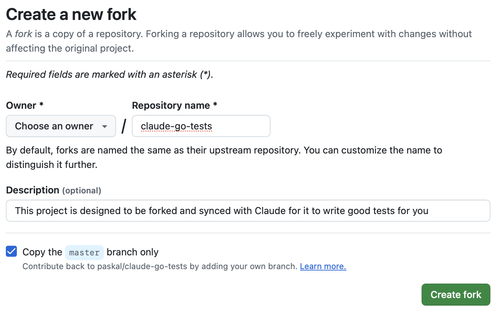
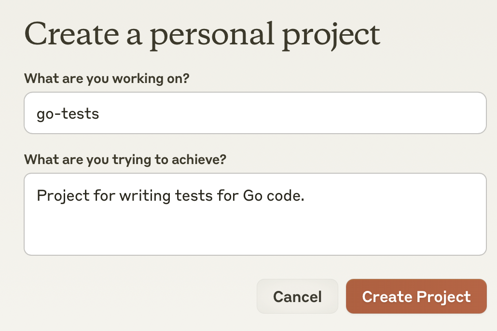
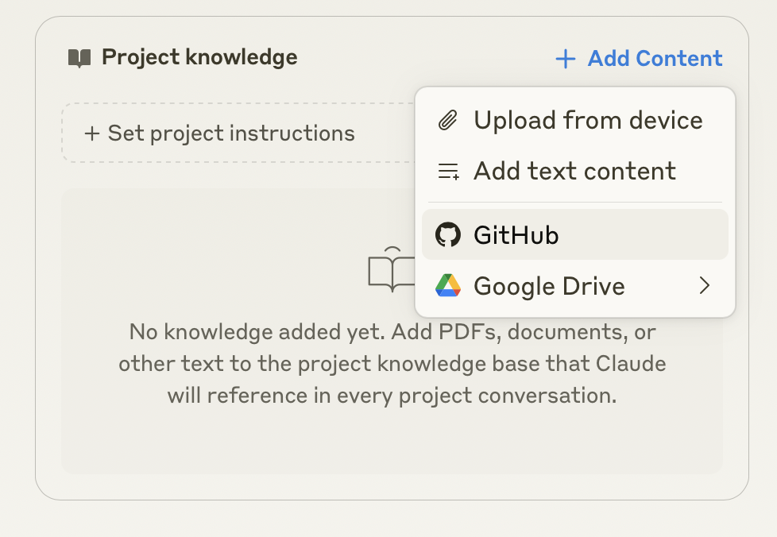
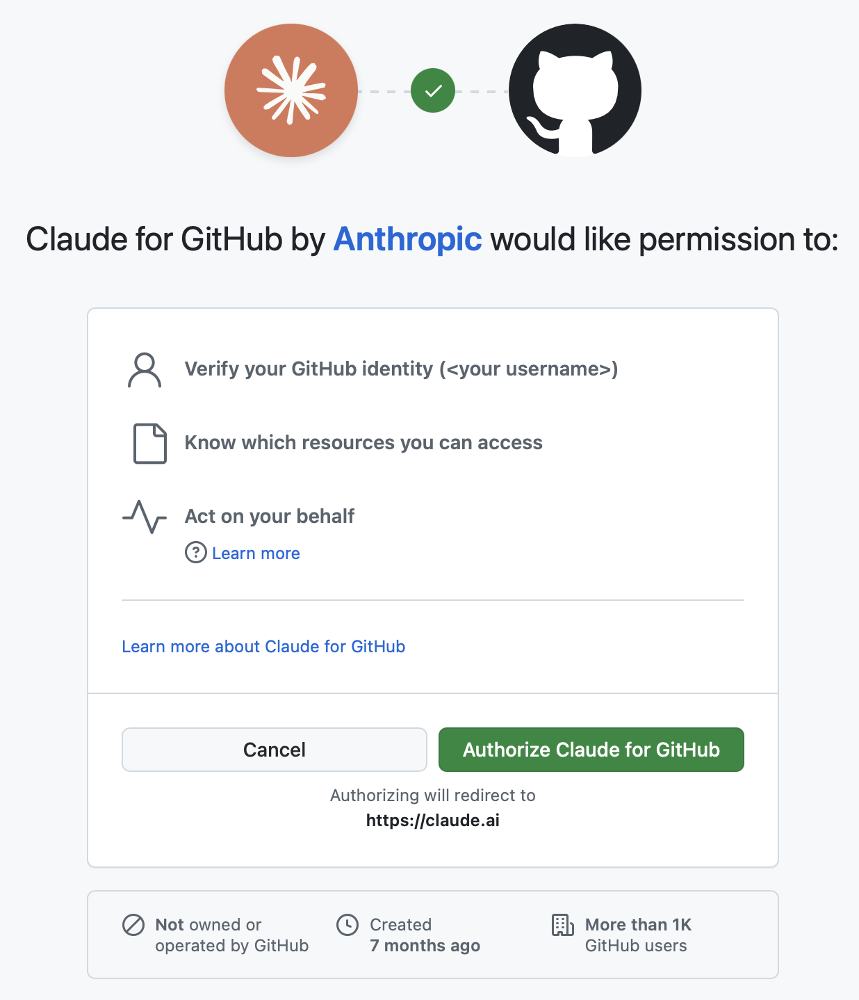
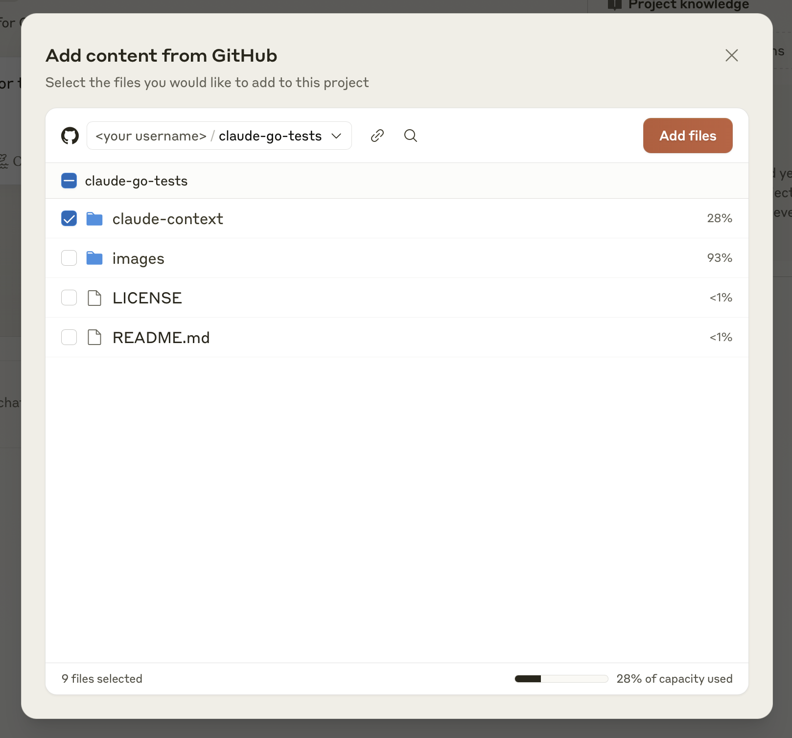
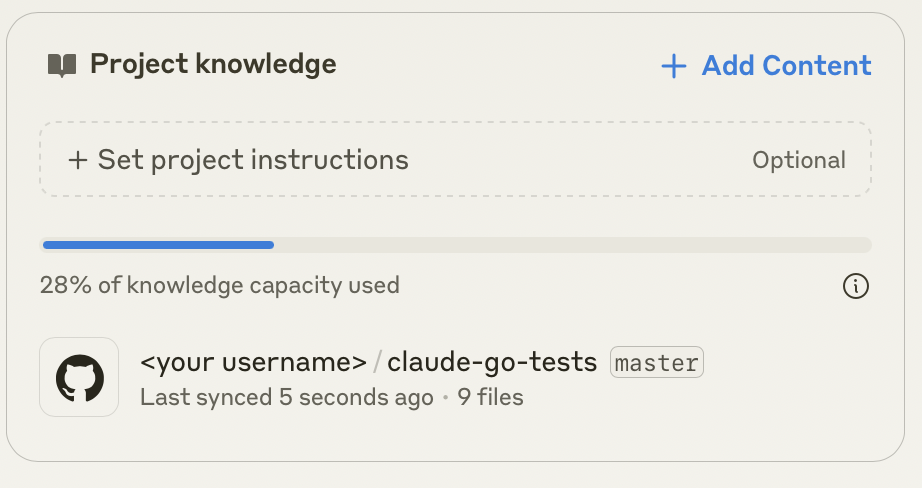
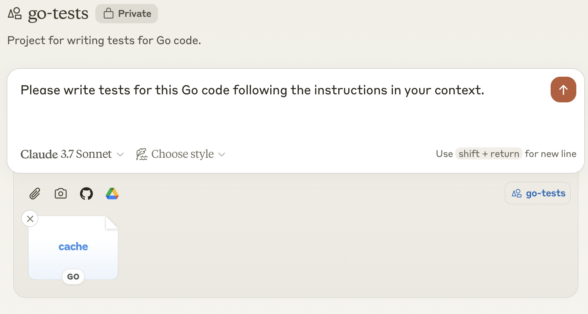

# Claude Go Tests Template

This repository serves as a template for writing robust Go tests using Claude AI. By forking this repository and connecting it to a Claude Project, you'll provide Claude with clear examples and context so it can generate tests that match your style and best practices.

## Quick Start Guide

1. **[Fork](https://github.com/paskal/claude-go-tests/fork)** claude-go-tests repository repository using the link.

    

2. **Create a Claude Project** (requires Claude Pro/Team subscription)
    - Navigate to [Claude](https://claude.ai) and sign in.
    - Navigate to Projects in the menu on the left
    - Click  **[Create project](https://claude.ai/projects/create)** on the top right and name it `go-tests`.
    - Fill in the prompt with the following text:
      ```plaintext
      Project for writing tests for Go code.
      ```
    - Click **Create Project**

        

3. **Connect Your Fork**
    - In your Claude project, click **Add Content** → **GitHub**.
    
    - If you haven't authorized Claude for GitHub yet, click **Authorize**

        
    - Select your forked `claude-go-tests` repository from the list.
    - **Select only the `claude-context` directory** — this folder includes instructions and examples Claude needs.

        
    - Click **Add Selected Files**.

        

4. **Start Writing Tests**
    - Drag and drop your Go file into the chat on the left
    - Use the following prompt as a starter:
    
        ```plaintext
        Please write tests for this Go code following the instructions in your context.
        ```

        


## Repository Structure

```plaintext
claude-go-tests/
├── README.md                  # This file
├── images/                    # Screenshots and documentation images
└── claude-context/            # Instructions and examples for Claude
     ├── INSTRUCTIONS.md       # Detailed instructions for Claude
     ├── *.go                  # Sample Go code
     ├── *_test.go             # Example test implementation
```
## What's Included

- **Test Patterns**: Examples of common Go testing strategies such as table-driven tests, mocks, and fixtures.
- **Style Guide**: Conventions for consistent test naming and structure.
- **Edge Cases**: Samples addressing error conditions and boundary scenarios.
- **Best Practices**: Guidelines to help ensure your tests are maintainable and effective.

## Why Use This Template?

1. **Consistent Testing**: Claude learns your preferred testing style from the examples in `claude-context`.
2. **Time Efficiency**: Quickly receive well-structured test suggestions that you can review and adapt.
3. **Best Practices**: Leverage established Go testing patterns and conventions.
4. **Learning Resource**: Ideal for teams looking to standardize and improve their testing approach.

## Contributing

Contributions are welcome! If you have suggestions for new test patterns or improvements to the examples, please submit a pull request.

## License

This project is licensed under the MIT License. See the [LICENSE](LICENSE) file for details.

Existing examples in the claude-context directory are sourced from MIT projects made by @umputun and @paskal.

---

## Official Documentation

For more details about Claude's GitHub integration [please see the official doc](https://support.anthropic.com/en/articles/10167454-using-the-github-integration). Please note:

- **GitHub Integration:** Claude connects directly to GitHub to fetch repository contents, which provides comprehensive context for generating tests.
- **Repository Sync:** Only the file names and contents from your selected branch are retrieved - commit history, pull requests, and other metadata are excluded.
- **Access Control:** For private repositories, make sure you grant the necessary permissions. If you lose access or encounter issues, refer to the prompts or contact your GitHub organization’s administrators.
- **Best Practices:** Start with a small subset of your codebase and regularly sync your repository to ensure Claude works with the latest version.

For the complete integration details and further instructions, please consult the `claude-context/instructions.md` file.

---

Happy testing with Claude!